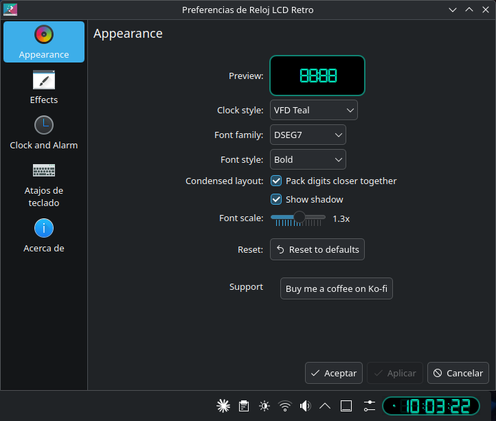

# Retro LCD 7-Segment Clock (Plasmoid)

[](https://www.gnu.org/licenses/gpl-3.0)[](https://github.com/corral1976/pulse/actions)
[](https://github.com/corral1976/pulse/releases)
[](https://github.com/corral1976/pulse)
[](https://opensource.org/licenses/MIT)
[](https://gitlab.com/corral1976/plasmoid-retro-lcd-clock/-/releases)
[](https://github.com/corral1976/plasmoid-retro-lcd-clock/actions)

A digital clock widget with a retro 7-segment LCD aesthetic for your KDE Plasma 6 desktop. Minimalist design, lightweight, and with an authentic vintage touch.

---

## Preview



---

## Features

- **7-Segment LCD Design:** Classic aesthetic with high-fidelity monospaced typography.
- **Panel Ready:** Automatically fits your panel's thickness instead of forcing a fixed size — no more oversized or square widgets.
- **Font Scale Slider:** Fine-tune the overall digit size (0.5x–2.0x) from the configuration panel, independently of the panel or widget size.
- **Two Font Families:** Choose between DSEG7 (classic 7-segment LCD) and DotMatrix (retro dot-matrix printer style).
- **4 Font Styles:** Choose between Regular, Bold, Italic, and Bold Italic, applied live from the configuration panel, for either font family.
- **Condensed Layout:** Optional tighter digit spacing, works with every font style.
- **8 Color Themes + Custom:** Neon Green, Vintage Amber, Sapphire Blue, Ruby Red, White Led, VFD Teal, Nixie Orange, Retro LCD, or pick any custom color for digits, separators, alarm dot and border, with a live preview.
- **Minimalist Design:** Seamless integration with any Plasma theme.
- **Alarm Support:** Customizable sound alarm functionality. When it rings, a floating dialog styled to match your chosen theme lets you Stop or Snooze (configurable duration), and a right-click "Snooze" action is also available directly on the widget.
- **Flicker Effect:** Optional retro screen-flicker animation for an authentic vintage LCD/CRT look.
- **Ghost Segments:** Optional dim "always-on" segment silhouette behind every digit, separator, AM/PM and date character, and the alarm dot — just like a real unlit LCD/VFD panel.
- **CRT Scanlines:** Optional subtle horizontal scanline overlay for an old-school CRT/VFD screen feel.
- **Minute-Change Flicker:** Optional brief flicker each time the minute rolls over, mimicking a mechanical relay-driven or aging display refreshing its value.
- **Startup Lamp Test:** Optional brief all-segments flash when the widget loads, just like the self-test on real digital clocks and microwaves.
- **Vertical Panel Support:** Digits, AM/PM indicator and date scale and stack cleanly on vertical panels, with real stacked-dot colon separators.
- **Resizable Floating Widget:** On the desktop, drag the widget's corners/edges to resize its container manually (subject to a minimum size set by the Plasma shell itself); digit size is adjusted separately via the Font Scale slider.
- **Configuration Panel:** Built-in interface split into Appearance, Effects, and Clock and Alarm pages, plus a one-click "Reset to defaults" button.
- **Adaptive:** Compatible with both light and dark Plasma color schemes.
- **Optimized:** Extremely lightweight and resource-efficient.

---

## Installation

### Option 1: From the KDE Store (Recommended)

1. Open **System Settings** → **Appearance** → **Widgets**.
2. Click on **"Get New Widgets"** → **"Download New Plasma Widgets"**.
3. Search for **"Retro LCD Clock"** and click **Install**.

### Option 2: Manual Installation

1. Download the latest release from the [GitLab repository](https://gitlab.com/corral1976/plasmoid-retro-lcd-clock).
2. Open a terminal in the folder where you downloaded the file and run:
   ```bash
   kpackagetool6 --type Plasma/Applet -i .
   ```

---

## Requirements

- **KDE Plasma 6**

---

## Project Structure

```text
/
├── contents/
│   ├── assets/
│   │   ├── DSEG7Classic-Regular.ttf
│   │   ├── DSEG7Classic-Bold.ttf
│   │   ├── DSEG7Classic-Italic.ttf
│   │   ├── DSEG7Classic-BoldItalic.ttf
│   │   ├── DotMatrix-Regular.ttf
│   │   ├── DotMatrix-Bold.ttf
│   │   ├── DotMatrix-Italic.ttf
│   │   ├── DotMatrix-BoldItalic.ttf
│   │   └── alarm.ogg
│   ├── code/
│   │   └── colorUtils.js
│   ├── config/
│   │   ├── config.qml
│   │   └── main.xml
│   ├── icons/
│   │   └── icon.svg
│   └── ui/
│       ├── main.qml
│       ├── configAppearance.qml
│       ├── configEffects.qml
│       ├── configClockAlarm.qml
│       ├── ShadowedText.qml
│       └── AlarmDot.qml
├── LICENSE
├── NOTICE.md
└── metadata.json
```

## Support the project

If you like this extension and want to support its development:

### ☕ [Buy me a coffee on Ko-fi](https://ko-fi.com/retrolcdclock)

Your support helps maintain and improve the project.

---

## License and Credits

This project is free software distributed under the GPL-3.0 license.

Third-party assets
Font: DSEG7-Classic by Keshikan. Licensed under the SIL Open Font License 1.1.

Alarm sound: "alarm clock buzzer alarm beep" by Garuda1982. Licensed under Creative Commons 0 (CC0).

For more details, see the NOTICE.md file.

Made by Carlos Corral
